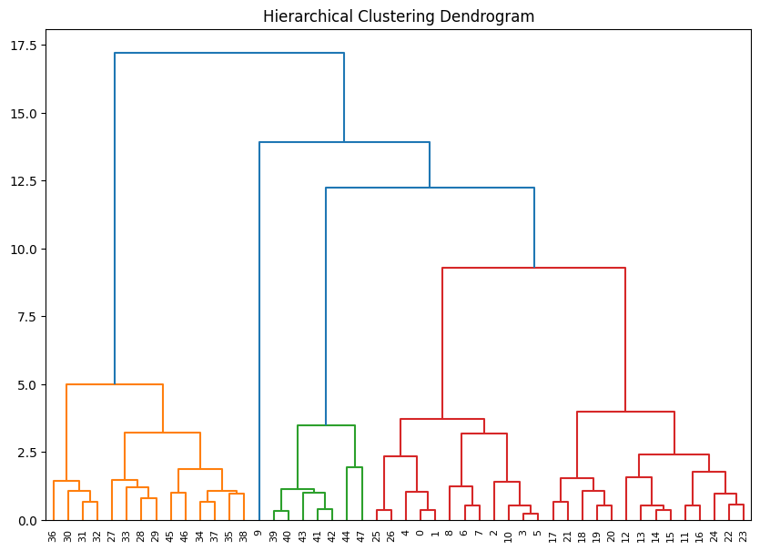

# Mapping Economic Similarities: Year Classification Based on Economic Inflation Indicators - ML

Download: [Data Analysis](https://github.com/GaMicNa/Mapping-Bolivia-s-Historical-Economic-Similarities-Year-Classification-Using-Machine-Learning/blob/127a3875686325e5481e9fae6a6f2b294d57ff9c/01_CLUSTERING%20ANALYSIS/01_CLUSTERING%20ANALYSIS.ipynb) | [Handout](04_DOC/DOC_MESBOL.pdf) | [Dashboard](https://public.tableau.com/views/INFOGRAM_MESBOL/Dashboard1?:language=en-US&:sid=A7CC4128A1454D47BE3738AE0DBAA004-0:0&:redirect=auth&:display_count=n&:origin=viz_share_link)

Currently there is a serious problem of shortage of dollars, gas and increased food prices in Bolivia. Since crises are a recurring phenomenon in this country, it forces me to consider the scenario of knowing if there are similar economic and social precedents to be able to take measures in this regard.
For this purpose, data provided by the World Bank was utilized, and machine learning techniques were applied to classify years that shared common economic and social patterns. The importance of this analysis lies in understanding how recurring economic events and implemented policies have impacted the Bolivian economy over time. Techniques such as K-means, Agglomerative Clustering, and Principal Component Analysis (PCA) were employed to create groups of years that exhibited similar behaviors, aiming to generate valuable insights for future economic policies.

